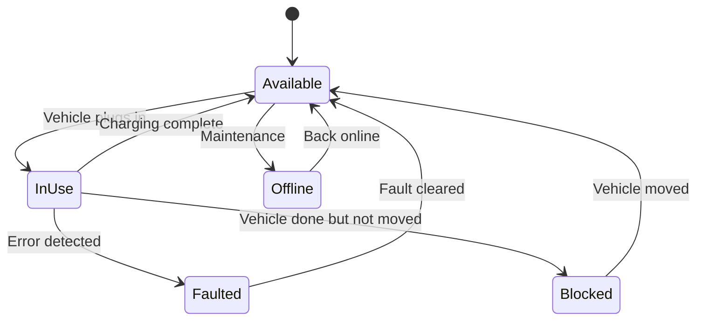
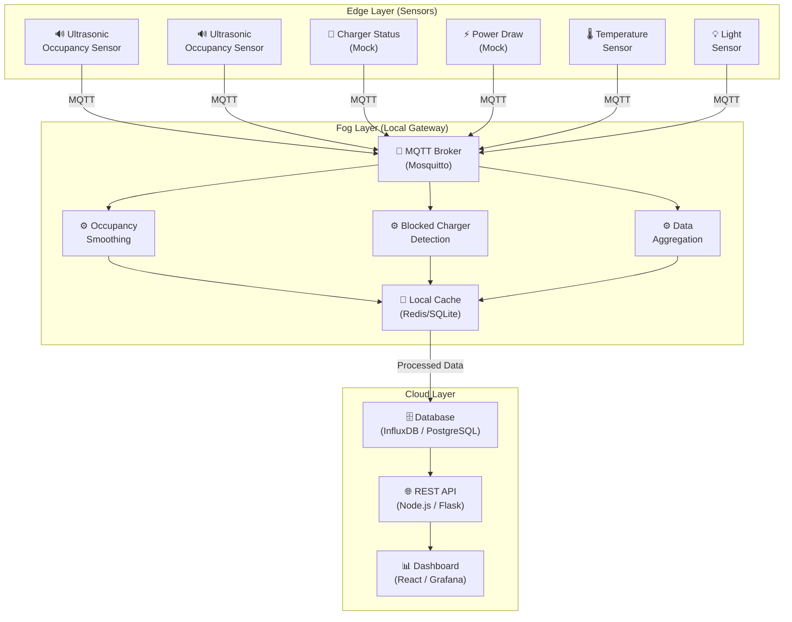

# Smart Parking + EV Charger Status

## 1. Project Overview

This project implements a **Fog and Edge Computing** solution for managing a smart parking facility with integrated EV (Electric Vehicle) charging stations. It uses IoT sensors deployed at the **edge** to collect real-time data about parking spot occupancy, EV charger status, power consumption, environmental conditions, and lighting. A **fog layer** processes, filters, and analyzes data close to the source before forwarding summaries to the **cloud** for storage and dashboard visualization.

### Objectives

| # | Objective |
|---|-----------|
| 1 | Monitor parking spot **occupancy** in real-time using ultrasonic sensors |
| 2 | Track EV charger **status** (available / in-use / faulted / blocked) |
| 3 | Monitor **power draw** of each charging station |
| 4 | Collect **temperature** and **ambient light** data for environmental awareness |
| 5 | Apply **fog-level processing** — occupancy smoothing & blocked-charger detection |
| 6 | Present live **dashboards** for availability maps and charger usage statistics |

---

## 2. Topics (MQTT Data Topics)

Data flows from sensors → fog nodes → cloud using an **MQTT** publish-subscribe model. Below are all the MQTT topics used in the project:

### Edge → Fog Topics (Raw Data)

| Topic | Description | Payload Example |
|-------|-------------|-----------------|
| `parking/{lot_id}/spot/{spot_id}/occupancy` | Raw ultrasonic sensor reading (occupied/vacant) | `{ "spot_id": "A-12", "occupied": true, "distance_cm": 15, "timestamp": "..." }` |
| `parking/{lot_id}/charger/{charger_id}/status` | Charger status from mock sensor | `{ "charger_id": "C-03", "status": "in_use", "vehicle_id": "EV-4821", "timestamp": "..." }` |
| `parking/{lot_id}/charger/{charger_id}/power` | Power draw reading from mock sensor (kW) | `{ "charger_id": "C-03", "power_kw": 7.2, "energy_kwh": 12.5, "timestamp": "..." }` |
| `parking/{lot_id}/environment/temperature` | Temperature sensor reading (°C) | `{ "lot_id": "LOT-1", "temp_c": 28.5, "humidity_pct": 65, "timestamp": "..." }` |
| `parking/{lot_id}/environment/light` | Ambient light sensor reading (lux) | `{ "lot_id": "LOT-1", "lux": 340, "daylight": true, "timestamp": "..." }` |

### Fog → Cloud Topics (Processed Data)

| Topic | Description | Payload Example |
|-------|-------------|-----------------|
| `fog/parking/{lot_id}/occupancy/smoothed` | Smoothed occupancy after debounce/window processing | `{ "lot_id": "LOT-1", "total_spots": 50, "occupied": 32, "available": 18, "timestamp": "..." }` |
| `fog/parking/{lot_id}/charger/blocked` | Alert when a blocked-charger pattern is detected | `{ "charger_id": "C-03", "blocked_since": "...", "duration_min": 45, "alert": true }` |
| `fog/parking/{lot_id}/charger/usage_stats` | Aggregated charger usage statistics | `{ "lot_id": "LOT-1", "active_chargers": 4, "total_energy_kwh": 120.5, "avg_session_min": 62 }` |
| `fog/parking/{lot_id}/environment/summary` | Environment summary (temp + light combined) | `{ "lot_id": "LOT-1", "avg_temp_c": 27.8, "avg_lux": 410, "timestamp": "..." }` |

---

## 3. Sensors — Detailed Breakdown

### 3.1 Occupancy Sensor (Ultrasonic)

| Property | Value |
|----------|-------|
| **Type** | HC-SR04 Ultrasonic Distance Sensor |
| **Purpose** | Detect whether a parking spot is occupied or vacant |
| **Principle** | Measures time-of-flight of an ultrasonic pulse; distance < threshold → occupied |
| **Range** | 2 cm – 400 cm |
| **Threshold** | < 30 cm → Spot is **occupied** |
| **Mounting** | Overhead or ground-level at each parking spot |
| **Output** | Distance in cm + boolean occupied flag |
| **Data Rate** | Every 2–5 seconds |
| **Implementation** | Real sensor (can be simulated with random values in mock mode) |

### 3.2 Charger Status Sensor (Mock)

| Property | Value |
|----------|-------|
| **Type** | Mock / Simulated digital sensor |
| **Purpose** | Report the current state of each EV charging station |
| **States** | `available`, `in_use`, `faulted`, `blocked`, `offline` |
| **Output** | Status string + optional vehicle ID |
| **Data Rate** | Every 10 seconds (or on state change) |
| **Implementation** | Software mock — generates realistic state transitions |

**State Machine:**



### 3.3 Power Draw Sensor (Mock)

| Property | Value |
|----------|-------|
| **Type** | Mock / Simulated power meter |
| **Purpose** | Measure instantaneous power draw (kW) and cumulative energy (kWh) |
| **Range** | 0 – 22 kW (Level 2 charger simulation) |
| **Output** | `power_kw` (instantaneous), `energy_kwh` (session total) |
| **Data Rate** | Every 5 seconds |
| **Implementation** | Software mock — generates realistic charging curves |

**Realistic Power Curve:** The mock simulates a real charging profile:
1. **Ramp-up** (0 → peak kW over ~2 min)
2. **Constant current** (steady at peak for bulk charging)
3. **Taper** (gradual decrease as battery fills)
4. **Trickle / Complete** (near-zero power)

### 3.4 Temperature Sensor

| Property | Value |
|----------|-------|
| **Type** | DHT22 / DS18B20 (or mock) |
| **Purpose** | Monitor ambient temperature in the parking facility |
| **Range** | -40°C to +80°C |
| **Accuracy** | ±0.5°C |
| **Output** | Temperature (°C) + Humidity (%) |
| **Data Rate** | Every 30 seconds |
| **Use Cases** | HVAC control, fire safety thresholds, seasonal analysis |

### 3.5 Light Sensor

| Property | Value |
|----------|-------|
| **Type** | BH1750 / LDR photoresistor (or mock) |
| **Purpose** | Measure ambient light level in the parking area |
| **Range** | 0 – 65,535 lux |
| **Output** | Lux value + daylight boolean (lux > 500 → daylight) |
| **Data Rate** | Every 30 seconds |
| **Use Cases** | Automated lighting control, energy saving, time-of-day analytics |

---

## 4. Fog Layer Processing

The fog layer sits between edge sensors and the cloud. It runs on a local gateway (e.g., Raspberry Pi, Intel NUC, or a VM) and performs **low-latency processing** before sending summarized data to the cloud.

### 4.1 Occupancy Smoothing

**Problem:** Ultrasonic sensors can produce noisy, flickering readings (e.g., a pedestrian walking past briefly triggers "occupied").

**Solution — Sliding Window Debounce:**

```
Algorithm: Occupancy Smoothing
─────────────────────────────
1. Maintain a sliding window of last N readings (e.g., N = 5)
2. For each new reading:
   a. Add to window, remove oldest
   b. Count occupied vs. vacant readings in the window
   c. If ≥ 3 out of 5 say "occupied" → report OCCUPIED
   d. Otherwise → report VACANT
3. Hysteresis: require 2 consecutive state changes before flipping
4. Publish smoothed result to fog/parking/{lot_id}/occupancy/smoothed
```

**Benefits:**
- Eliminates false positives from pedestrians or brief sensor glitches
- Reduces message volume to the cloud by ~60 %
- Adds only ~10 seconds of latency (acceptable for parking)

### 4.2 Blocked Charger Detection

**Problem:** A vehicle finishes charging but remains parked at the charger, blocking other EVs.

**Detection Logic:**

```
Algorithm: Blocked Charger Detection
─────────────────────────────────────
1. Monitor charger status + power draw together
2. Detect "blocked" pattern:
   a. Charger status = "in_use"  (vehicle is plugged in)
   b. Power draw < 0.5 kW       (charging essentially complete)
   c. Duration > 30 minutes      (vehicle hasn't moved)
3. When pattern detected:
   a. Set charger status → "blocked"
   b. Publish alert to fog/parking/{lot_id}/charger/blocked
   c. Trigger notification (optional: app push, display board)
4. Clear alert when:
   a. Vehicle moves (occupancy sensor goes vacant)
   b. OR power draw resumes (user restarted charging)
```

---

## 5. Dashboard Requirements

### 5.1 Parking Availability Dashboard

| Component | Description |
|-----------|-------------|
| **Live Grid Map** | Visual grid showing each spot as green (vacant) / red (occupied) / yellow (reserved) |
| **Availability Counter** | Large display: `18 / 50 spots available` |
| **Occupancy Trend Chart** | Line chart of occupancy % over last 24 hours |
| **Average Dwell Time** | Metric showing average time vehicles stay parked |
| **Heatmap** | Color-coded map showing which areas fill up first |

### 5.2 Charger Usage Dashboard

| Component | Description |
|-----------|-------------|
| **Charger Status Grid** | Each charger shown with its current state (available / in-use / faulted / blocked) |
| **Active Sessions** | Table of ongoing charging sessions with vehicle ID, duration, energy delivered |
| **Energy Consumption Chart** | Bar chart of total kWh consumed per charger per day |
| **Blocked Charger Alerts** | Red alert banner when a charger is blocked, with duration |
| **Usage Statistics** | Avg session duration, peak hours, total vehicles served today |
| **Revenue Estimate** | Estimated revenue based on kWh × rate |

### 5.3 Environmental Panel

| Component | Description |
|-----------|-------------|
| **Temperature Gauge** | Current temperature with min/max over 24 h |
| **Light Level Indicator** | Current lux reading + daylight/night status |
| **Historical Charts** | Temperature and light trends over time |

---

## 6. System Architecture



---

## 7. Step-by-Step Implementation Guide

### Phase 1: Environment Setup

| Step | Action | Details |
|------|--------|---------|
| 1.1 | **Install Python 3.10+** | Download from [python.org](https://python.org). Verify: `python --version` |
| 1.2 | **Install Node.js 18+** | Download from [nodejs.org](https://nodejs.org). Verify: `node --version` |
| 1.3 | **Install MQTT Broker** | Install Mosquitto: `sudo apt install mosquitto mosquitto-clients` (Linux) or download from [mosquitto.org](https://mosquitto.org) (Windows) |
| 1.4 | **Install Database** | Option A: InfluxDB (time-series) or Option B: PostgreSQL + TimescaleDB |
| 1.5 | **Create Project Structure** | See folder structure below |

**Project Folder Structure:**

```
Smart Parking + EV Charger Status/
├── sensors/                    # Edge layer — sensor simulators
│   ├── occupancy_sensor.py     # Ultrasonic sensor simulator
│   ├── charger_status_sensor.py# EV charger status mock
│   ├── power_draw_sensor.py    # Power consumption mock
│   ├── temperature_sensor.py   # Temperature sensor simulator
│   ├── light_sensor.py         # Light sensor simulator
│   └── config.py               # Sensor configuration (intervals, thresholds)
├── fog/                        # Fog layer — processing logic
│   ├── occupancy_smoother.py   # Sliding window debounce
│   ├── blocked_charger_detector.py  # Pattern detection
│   ├── data_aggregator.py      # Combine & summarize data
│   └── fog_node.py             # Main fog node entry point
├── cloud/                      # Cloud layer — API & storage
│   ├── api/
│   │   ├── server.py           # REST API (Flask/FastAPI)
│   │   └── routes.py           # API endpoints
│   ├── database/
│   │   ├── models.py           # Database models
│   │   └── connection.py       # DB connection management
│   └── config.py               # Cloud configuration
├── dashboard/                  # Frontend dashboard
│   ├── public/
│   ├── src/
│   │   ├── components/
│   │   │   ├── ParkingGrid.jsx       # Live parking grid
│   │   │   ├── ChargerStatus.jsx     # Charger status panel
│   │   │   ├── EnergyChart.jsx       # Energy consumption chart
│   │   │   ├── OccupancyTrend.jsx    # Occupancy trend line
│   │   │   ├── EnvironmentPanel.jsx  # Temp + light panel
│   │   │   └── AlertBanner.jsx       # Blocked charger alerts
│   │   ├── App.jsx
│   │   └── index.jsx
│   └── package.json
├── docker-compose.yml          # Container orchestration
├── requirements.txt            # Python dependencies
└── README.md
```

---

### Phase 2: Build Sensor Simulators (Edge Layer)

#### Step 2.1 — Install Python Dependencies

```bash
pip install paho-mqtt numpy faker
```

#### Step 2.2 — Create Sensor Configuration (`sensors/config.py`)

```python
MQTT_BROKER = "localhost"
MQTT_PORT = 1883
LOT_ID = "LOT-1"

# Sensor intervals (seconds)
OCCUPANCY_INTERVAL = 3
CHARGER_STATUS_INTERVAL = 10
POWER_DRAW_INTERVAL = 5
TEMPERATURE_INTERVAL = 30
LIGHT_INTERVAL = 30

# Parking lot layout
TOTAL_SPOTS = 50
TOTAL_CHARGERS = 8

# Occupancy threshold (cm)
OCCUPANCY_THRESHOLD = 30
```

#### Step 2.3 — Implement Occupancy Sensor (`sensors/occupancy_sensor.py`)

The occupancy sensor:
1. Simulates an ultrasonic sensor for each parking spot
2. Generates realistic distance readings using random variations
3. Publishes to `parking/{lot_id}/spot/{spot_id}/occupancy` every 3 seconds
4. Includes occasional "noise" readings to test fog smoothing

#### Step 2.4 — Implement Charger Status Sensor (`sensors/charger_status_sensor.py`)

The charger status sensor:
1. Maintains a state machine for each charger (available → in_use → blocked, etc.)
2. Generates realistic state transitions at random intervals
3. Publishes to `parking/{lot_id}/charger/{charger_id}/status` every 10 seconds

#### Step 2.5 — Implement Power Draw Sensor (`sensors/power_draw_sensor.py`)

The power draw sensor:
1. Simulates a realistic EV charging curve (ramp → constant → taper → complete)
2. Correlates with charger status (only draws power when `in_use`)
3. Publishes to `parking/{lot_id}/charger/{charger_id}/power` every 5 seconds

#### Step 2.6 — Implement Temperature & Light Sensors

- **Temperature:** Simulates daily temperature cycle (cooler at night, warmer in afternoon) with ±1°C noise
- **Light:** Simulates daylight cycle (0 lux at night, 500+ during day) with cloud cover variations

---

### Phase 3: Build Fog Layer Processing

#### Step 3.1 — Implement Occupancy Smoother (`fog/occupancy_smoother.py`)

1. Subscribe to all raw occupancy topics: `parking/+/spot/+/occupancy`
2. Maintain a sliding window of 5 readings per spot
3. Apply majority voting (≥ 3/5 = occupied)
4. Add hysteresis (require 2 consecutive flips)
5. Publish smoothed data to `fog/parking/{lot_id}/occupancy/smoothed`

#### Step 3.2 — Implement Blocked Charger Detector (`fog/blocked_charger_detector.py`)

1. Subscribe to charger status: `parking/+/charger/+/status`
2. Subscribe to power draw: `parking/+/charger/+/power`
3. Correlate: if status = `in_use` AND power < 0.5 kW for > 30 min → BLOCKED
4. Publish alert to `fog/parking/{lot_id}/charger/blocked`

#### Step 3.3 — Implement Data Aggregator (`fog/data_aggregator.py`)

1. Collect all processed data
2. Compute aggregate stats every 60 seconds:
   - Total occupied / available spots
   - Active charging sessions count
   - Total energy consumed
   - Average temperature & light level
3. Push aggregated data to cloud topics / REST API

---

### Phase 4: Build Cloud Layer (API + Database)

#### Step 4.1 — Set Up Database

```sql
-- PostgreSQL schema
CREATE TABLE parking_spots (
    id SERIAL PRIMARY KEY,
    spot_id VARCHAR(10) UNIQUE,
    lot_id VARCHAR(20),
    is_occupied BOOLEAN DEFAULT FALSE,
    last_updated TIMESTAMP DEFAULT NOW()
);

CREATE TABLE charger_sessions (
    id SERIAL PRIMARY KEY,
    charger_id VARCHAR(10),
    vehicle_id VARCHAR(20),
    status VARCHAR(20),
    power_kw FLOAT,
    energy_kwh FLOAT,
    started_at TIMESTAMP,
    ended_at TIMESTAMP,
    is_blocked BOOLEAN DEFAULT FALSE
);

CREATE TABLE environment_logs (
    id SERIAL PRIMARY KEY,
    lot_id VARCHAR(20),
    temperature_c FLOAT,
    humidity_pct FLOAT,
    lux FLOAT,
    recorded_at TIMESTAMP DEFAULT NOW()
);
```

#### Step 4.2 — Build REST API (`cloud/api/server.py`)

Key endpoints:

| Method | Endpoint | Description |
|--------|----------|-------------|
| GET | `/api/parking/availability` | Current availability for all spots |
| GET | `/api/parking/occupancy-history` | Occupancy trend data (last 24 h) |
| GET | `/api/chargers/status` | Current status of all chargers |
| GET | `/api/chargers/sessions` | Active and recent charging sessions |
| GET | `/api/chargers/energy` | Energy consumption stats |
| GET | `/api/chargers/blocked` | Currently blocked chargers |
| GET | `/api/environment/current` | Latest temperature & light readings |
| GET | `/api/environment/history` | Environmental data over time |
| GET | `/api/dashboard/summary` | Combined summary for dashboard |

#### Step 4.3 — MQTT-to-Database Bridge

Create a service that:
1. Subscribes to all `fog/parking/...` topics
2. Parses incoming JSON payloads
3. Inserts/updates database records
4. Handles connection retries and error logging

---

### Phase 5: Build Dashboard (Frontend)

#### Step 5.1 — Initialize React App

```bash
npx -y create-vite@latest ./ -- --template react
npm install
npm install axios recharts socket.io-client
```

#### Step 5.2 — Build Dashboard Components

| Component | Description |
|-----------|-------------|
| `ParkingGrid` | Visual grid of spots (green/red/yellow) with real-time updates |
| `ChargerStatus` | Card-based display for each charger with status badges |
| `EnergyChart` | Recharts bar chart showing kWh per charger |
| `OccupancyTrend` | Recharts line chart showing occupancy % over time |
| `EnvironmentPanel` | Temperature gauge + light level indicator |
| `AlertBanner` | Red alert bar for blocked charger notifications |

#### Step 5.3 — Connect to API & WebSocket

1. Fetch initial data from REST API on page load
2. Establish WebSocket connection for real-time updates
3. Update components reactively as new data arrives

---

### Phase 6: Integration & Testing

| Step | Action | Command |
|------|--------|---------|
| 6.1 | Start MQTT broker | `mosquitto -v` |
| 6.2 | Start database | `docker compose up -d db` |
| 6.3 | Start sensor simulators | `python sensors/occupancy_sensor.py &` (repeat for each sensor) |
| 6.4 | Start fog node | `python fog/fog_node.py` |
| 6.5 | Start API server | `python cloud/api/server.py` |
| 6.6 | Start dashboard | `cd dashboard && npm run dev` |
| 6.7 | Verify MQTT flow | `mosquitto_sub -t "parking/#" -v` |
| 6.8 | Verify fog output | `mosquitto_sub -t "fog/#" -v` |
| 6.9 | Open dashboard | Visit `http://localhost:5173` |

---

### Phase 7: Docker Deployment (Optional)

```yaml
# docker-compose.yml
version: '3.8'
services:
  mosquitto:
    image: eclipse-mosquitto:2
    ports:
      - "1883:1883"
    volumes:
      - ./mosquitto.conf:/mosquitto/config/mosquitto.conf

  postgres:
    image: postgres:15
    environment:
      POSTGRES_DB: smart_parking
      POSTGRES_USER: admin
      POSTGRES_PASSWORD: parking123
    ports:
      - "5432:5432"

  sensors:
    build: ./sensors
    depends_on:
      - mosquitto

  fog:
    build: ./fog
    depends_on:
      - mosquitto

  api:
    build: ./cloud
    depends_on:
      - postgres
      - mosquitto
    ports:
      - "5000:5000"

  dashboard:
    build: ./dashboard
    depends_on:
      - api
    ports:
      - "5173:5173"
```

---

## 8. Technology Stack Summary

| Layer | Technology | Purpose |
|-------|-----------|---------|
| **Edge** | Python + paho-mqtt | Sensor simulation & MQTT publishing |
| **Fog** | Python + paho-mqtt | Data processing (smoothing, pattern detection) |
| **Messaging** | Mosquitto (MQTT) | Lightweight pub/sub messaging |
| **Database** | PostgreSQL / InfluxDB | Persistent storage |
| **API** | Flask / FastAPI | REST endpoints |
| **Dashboard** | React + Vite + Recharts | Real-time visualization |
| **Deployment** | Docker Compose | Container orchestration |

---

## 9. Key Fog Computing Concepts Demonstrated

| Concept | How It's Applied |
|---------|-----------------|
| **Low-latency processing** | Occupancy smoothing happens at the fog, not the cloud |
| **Bandwidth reduction** | Fog aggregates sensor data, reducing cloud traffic by ~60 % |
| **Local decision-making** | Blocked charger detection triggers alerts without cloud round-trip |
| **Edge–Fog–Cloud hierarchy** | Three-layer architecture with each layer having a distinct role |
| **Data filtering** | Fog filters noise from raw ultrasonic readings |
| **Intermittent connectivity** | Local cache (Redis/SQLite) ensures data is preserved if cloud is unreachable |
